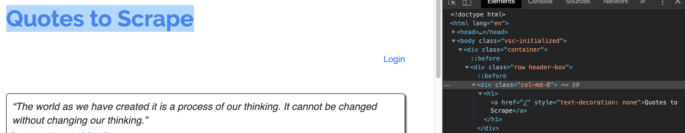
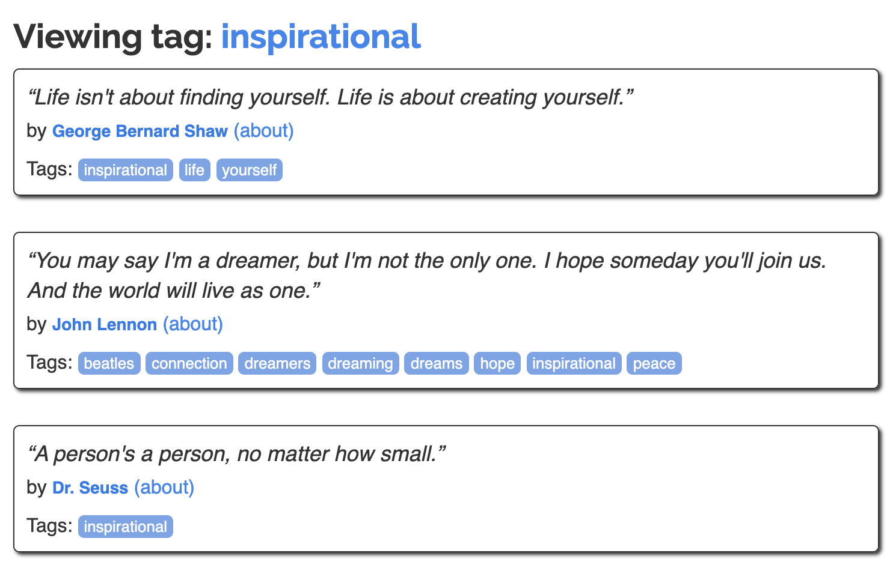

# Desenvolvendo um Crawler API com Scrapy e Klein

## Escopo

Hoje vamos desenvolver uma API para buscar frases por tags no site http://quotes.toscrape.com/ . Nossa API deve receber uma tag como parâmetro, fazer o scraping da página e nos retornar um `json` contendo uma lista com as frases e autores pertencentes aquela tag.

### Exemplo

```sh
curl -X POST \
  http://localhost:8080/search \
  -d '{"tag": "inspirational"}'
```

```sh
>> [{"text": "\u201cThere are only two ways to live your life. One is as though nothing is a miracle. The other is as though everything is a miracle.\u201d", "author": "Albert Einstein"}]
```

## Pré-Requisitos

- Python 3
- Pipenv

## Desenvolvendo o Crawler

Para desenvolver o nosso crawler nós vamos utilizar o Scrapy e o site fictício http://quotes.toscrape.com/ pertencente ao [Web Scraping Sandbox](http://toscrape.com/) do Scrapinghub.

### O que é o Scrapy?

Scrapy (se pronuncia iscreipi - sim eu também falei errado a vida toda) é um web crawling framework de código aberto e gratuito, escrito em Python. Originalmente projetado para fazer web scraping, também pode ser usar para extração de dados de APIs ou como um web crawler de propósito geral. É mantido por Scrapinghub Ltda, uma empresa de serviços e desenvolvimento de web scraping.

### Por que usar o Scrapy?

- Scrapy é uma ferramenta de código aberta e gratuita para uso.
- É fácil de construir e escalar para projetos grande de crawling.
- Possui uma ferramenta que o acompanha chamada Selectors, para extração de dados de sites.
- Lida com chamadas de maneira assíncrona e rápida.

Esse último ponto vai ser importante para nós no futuro

### Mãos a obra

#### Configurando o projeto

1. Clone o repositório

`$ git clone https://github.com/betinacosta/scrapy-klein-tutorial.git`

2. Dentro da pasta do projeto rode o seguinte comando:

`make setup`

Isso irá criar, ativar e instalar tanto o Scrapy quanto o Klein em um virtualenv para podermos utilziar. Caso tudo corra bem, você deve ver algo parecido com isso no seu terminal:


Para testar que o Scrapy foi instalado corretamente, rode o comando abaixo para exibir a versão do framework:

`$ scrapy version`

#### Criando um projeto

1. O scrapy possui um comando para iniciar um projeto com tudo que precisamos, para isso basta rodar:

`$ scrapy startproject tutorial`

Esse comando gerou os seguintes arquivos:

- **scrapy.cfg**: arquivo de configurações de deploy
- **items.py**: arquivo de definição dos itens do projeto
- **middlewares.py** : arquivo de middlewares do projeto
- **pipelines.py**: arquivo de pipelines do projeto
- **settings.py**: arquivo de configurações do projeto
- **spiders/**: uma pasta onde serão colocados os spiders mais tarde

Iremos nos aprofundar mais nesses arquivos conforme a necessidade surgir durante o tutorial.

#### Criando nosso primeiro spider

Spiders são classes que você define e que o Scrapy utiliza para fazer crawling das informações nos sites.

Vamos criar um arquivo chamado `quotes_spider.py` dentro da pasta `tutorial/tutorial/spiders/quotes_spider.py` com o seguinte conteúdo:

```python
import scrapy


class QuotesSpider(scrapy.Spider):
    name = "quotes"

    def start_requests(self):
        urls = [
            'http://quotes.toscrape.com/',
        ]
        for url in urls:
            yield scrapy.Request(url=url, callback=self.parse)

    def parse(self, response):
        self.log(">>>>>>>>>>>> " + response.url + " <<<<<<<<<<<<<<")
```

Ok, o que está acontecendo nesse arquivo? O método `start_requests` define (como o nome sugere) por onde o nosso spider vai começar suas atividades no site ou sites definidos na variável `urls` e qual método aplicar nesses sites, definidos na `callback`. 

O que estamos fazendo no método parse no momento é simplesmente logar a url do site visitado pelo nosso spider, mas futuramente iramos colher informações da página.

Para rodar a nossa spider vamos no entra no projeto e executar o spider:

`$ cd tutorial`

`$ scrapy crawl quotes`

A nossa mensagem super original junto com a url do site deve ter sido logada no nível de `DEBUG`

#### Entendo a página

Antes de começarmos a colher informações com o nosso spider, precisamos entender melhor a estrutura da página da qual queremos colher informações e nesses momentos precisaremos de um pouco de entendimento de dois dos quatro cavaleiros do apocalipse: HTML e CSS. A forma como iremos colher as informações que necessitamos do site será através de seletores. Vamos dar uma inspecionada no site e ver onde está localizada.

Vamos começar tentando localizar o texto `Quotes to Scrape`. Quando você inspecionar a página verá que ele se encontra dentro do `a` dentro do `h1` que se encontra dentro de uma `div` com a classe `col-md-8`. Como mostra a imagem abaixo:



Para testar se conseguimos selecionar esse texto através da classe e das tags, vamos utilizar uma ferramenta muito util do scrapy: o scrapy shell:

`$ scrapy shell http://quotes.toscrape.com/`

Esse comando irá baixar a página e nos fornecer um objeto `response` que nos permitirá fazer algumas operações. Para verificar se conseguimos selecionar o texto que desejamos, vamos executar:

`$ response.css("div.col-md-8>h1>a::text").extract_first()`

Funcionou \o/ 


Ok, mas que diabos é isso? 

`response.css()` é o que utilizamos para selecionar elementos da página com base em um seletor css. Ele deve receber o caminho para o elemento desejado.

`div.page-header>h1>a::text` diz que queremos o texto do `a` que está dentro do `h1` que se encontra dentro da `div` que possui a classe `col-md-8`

`extract_first()` response.css nos retornará um `selector` e para extrair as informações que precisamos utilizamos o método `extract`. Porém ele nos retornará uma lista. Nesse caso específico como temos apenas um item como conteúdo, podemos usar uma variação desse método, o `extract_first` para pegarmos a informação desejada. 

#### Pegando as frases por tag

Beleza! Agora que já temos uma noção de como selecionar elementos da página, vamos tentar selecionar as frases de uma determinada tag.

Observando o site e as páginas das tags, vemos que a construção da url dessa página se mantém constante, por esse motivo vamos usar isso ao nosso favor.

`http://quotes.toscrape.com/tag/nome_da_tag`

Obs.: Há alguns problemas com essa abordagem, como por exemplo ser baseada no fato de que as urls sempre seguirão esse padrão, mas esse não é o objetivo do tutorial.

Nesse primeiro momento, vamos assumir uma tag fixa. Posteriormente, receberemos a tag como parâmetro na nossa API.

```python
import scrapy


class QuotesSpider(scrapy.Spider):
    name = "quotes"

    def __init__(self):
        self.tag = "inspirational"

    def start_requests(self):
        base_url = "http://quotes.toscrape.com/tag/"
        urls = [
            base_url + self.tag,
        ]
        for url in urls:
            yield scrapy.Request(url=url, callback=self.parse)

    def parse(self, response):
        self.log(">>>>>>>>>>>> " + response.url + " <<<<<<<<<<<<<<")

```

O que fizemos foi adicionar uma tag fixa no `__init__` e utilizamos ela para montar a url no `start_requests`.

Agora, vamos analisar a página e ver como podemos pegar o texto e o author das citações.



Podemos fazer isso selecionando a `div` que contem as citações e iterando sobre os seus seletores:

```python
import scrapy


class QuotesSpider(scrapy.Spider):
    name = "quotes"

    def __init__(self):
        self.tag = "inspirational"

    def start_requests(self):
        base_url = "http://quotes.toscrape.com/tag/"
        urls = [
            base_url + self.tag,
        ]
        for url in urls:
            yield scrapy.Request(url=url, callback=self.parse)

    def parse(self, response):
        quotes_selectors = response.css("div.quote")

        for selector in quotes_selectors:

            quote = selector.css("span.text::text").extract_first()
            author = ?
```

Uma pausa para descobrir como obter a informação do autor. Fique a vontade para usar o scrapy shell e pedir ajuda para a minha pessoa :)

Beleza, se tudo der certo (deu sim, fé no pai), nós já temos todas as informações que precisamos. Agora vamos retornar essas informações. Para isso, vamos abrir o arquivo `tutorial/tutorial/items.py` e criar um Item. 

Para definir uma saída formatada o Scrapy oferece a classe Item. Objetos do tipo Item são simples containers para coletar os dados. Eles oferencem uma API parecida com um dicionário do Python com uma linguagem conveniente para declarar seus campos disponíveis.

```python
import scrapy


class Quote(scrapy.Item):
    text = scrapy.Field()
    author = scrapy.Field()
```

E agora vamos importar no `quotes_spider.py` e utilizar no lugar das variáveis.

```python
import scrapy

from tutorial.items import Quote

class QuotesSpider(scrapy.Spider):
    name = "quotes"

    def __init__(self):
        self.tag = "inspirational"

    def start_requests(self):
        base_url = "http://quotes.toscrape.com/tag/"
        urls = [
            base_url + self.tag,
        ]
        for url in urls:
            yield scrapy.Request(url=url, callback=self.parse)

    def parse(self, response):
        quotes_selectors = response.css("div.quote")

        for selector in quotes_selectors:
            quote = Quote()

            quote["text"] = selector.css("span.text::text").extract_first()
            quote["author"] = seu_codigo_bonitao
```

Beleza e como retornamos isso? A spider do Scrapy costuma gerar dicionários contendo os dados extraídos da página. Para fazer isso nós usamo o `yield` do Python no callback.

```python
import scrapy

from tutorial.items import Quote

class QuotesSpider(scrapy.Spider):
    name = "quotes"

    def __init__(self):
        self.tag = "inspirational"

    def start_requests(self):
        base_url = "http://quotes.toscrape.com/tag/"
        urls = [
            base_url + self.tag,
        ]
        for url in urls:
            yield scrapy.Request(url=url, callback=self.parse)

    def parse(self, response):
        quotes_selectors = response.css("div.quote")

        for selector in quotes_selectors:
            quote = Quote()

            quote["text"] = selector.css("span.text::text").extract_first()
            quote["author"] = seu_codigo_bonitao

            yield quote
```

Pronto! Agora se rodarmos o nosso spider com `scrapy crawl quotes` vamos ver que as informações foram coletadas com sucesso.


Para finalizar o nosso crawler com chave de ouro, temos um outro detalhe importante para verificar: paginação. É necessário "repetir" esse procedimento para as próximos páginas de citações caso elas existam. Para isso, vamos adicionar uma lógica de paginação depois do nosso `for` e adicionar a variável `start_urls` no nosso `__init__`. Essa variável é necessária para que o método `response.urljoin`, utilizado na paginação, consiga se achar corretamente.

```python
import scrapy

from tutorial.items import Quote

class QuotesSpider(scrapy.Spider):
    name = "quotes"

    def __init__(self):
        self.tag = "inspirational"
        self.start_urls = ["http://quotes.toscrape.com/"]

    def start_requests(self):
        base_url = "http://quotes.toscrape.com/tag/"
        urls = [
            base_url + self.tag,
        ]
        for url in urls:
            yield scrapy.Request(url=url, callback=self.parse)

    def parse(self, response):
        quotes_selectors = response.css("div.quote")

        for selector in quotes_selectors:
            quote = Quote()

            quote["text"] = selector.css("span.text::text").extract_first()
            quote["author"] = seu_codigo_bonitao

            yield quote

        next_page_url = response.css("li.next>a::attr(href)").extract_first()

        if next_page_url:
            next_page_url = response.urljoin(next_page_url)
            yield scrapy.Request(url=next_page_url, callback=self.parse)
```

Pronto! Com isso finalizamos nosso crawler e podemos partir para a API!

## Desenvolvendo a API

Agora que já temos o nosso spider pronto! Podemos seguir para o desenvolvimento da API com o Klein!

### Por que o Klein?

Mas Betina, com tantos frameworks mais conhecidos e estabelecidos, porque raios usar o Klein e não o Flask, o Bottle ou até mesmo o Django (você quer overkill, @?)?

Bom, lembra que lá em cima eu disse que o fato de o scrapy lidar com os requests de maneira assíncrona seria importante para esse tutorial? Então, por esse motivo ele não costuma conversar muito bem com esses frameworks que estão acostumados a fazer os requests de maneira síncrona. 

Klein é um micro-framework para desenvolver serviços Python prontos para ir para produção. O Twisted é um framework baseado em eventos que ajuda a lidar com assincronia.

### Montando o app.py

A sintaxe do Klein é bem parecida com a do Flask. para montar o esqueleto básico da nossa API basta criar um arquivo `app.py` na raiz do projeto. (fora do escopo do scrapy)

```python
from klein import Klein
app = Klein()

@app.route("/")
def index(request):
    return "Bom dia, flor do dia. Daqui a pouco tem almoço"

app.run("localhost", 8080)
```

Vamos rodar esse pedaço para ver se funciona antes de seguir em frente:

`$ python app.py`

E em outra aba do terminal:

```sh
curl -X GET \
  http://localhost:8080/
```

Agora vamos criar o endpoint para enviar uma tag parar ser pesquisada:

```py
from klein import Klein
app = Klein()

@app.route("/")
def index(request):
    return "Bom dia, flor do dia"

@app.route('/search')
def get_quotes(request):
    content = json.loads(request.content.read())
    tag = content.get("tag")

app.run("localhost", 8080)
```

## Juntando tudo

### Spider Runner

Agora vamos criar um runner para o nosso spider. Isso ira possibilitar a execução programática do nosso spider. Para isso vamos criar o arquivo `spider_runner.py` no mesmo nível do app.py

```python
class SpiderRunner(CrawlerRunner):
    def crawl(self, spider, *args, **kwargs):
        self.items = []

        crawler = self.create_crawler(spider)
        crawler.signals.connect(self._collect_item, signals.item_scraped)

        deferred = self._crawl(crawler, *args, **kwargs)
        deferred.addCallback(self._return_items)

        return deferred

    def _collect_item(self, item, response, spider):
        self.items.append(item)

    def _return_items(self, result):
        return self.items
```

O método crawl será responsável por executar o nosso spider.

### De volta ao Spider

Antes de prosseguirmos com a API, precisamos preparar o nosso spider para receber um parâmetro. Vamos enviar a tag na construção da classe `QuotesSpider`.

```py
import scrapy

from tutorial.items import Quote

class QuotesSpider(scrapy.Spider):
    name = "quotes"

    def __init__(self, tag):
        self.tag = tag
        self.start_urls = ["http://quotes.toscrape.com/"]
```

### De volta a API

Agora vamos adicionar a chamada para o spider_runner no nosso endpoint e passar o parâmetro que o nosso Spider espera....

```py
@app.route('/search')
def get_quotes(request):
    content = json.loads(request.content.read())
    tag = content.get("tag")
   
    runner = SpiderRunner()

    deferred = runner.crawl(QuotesSpider, tag=tag)
    deferred.addCallback(return_spider_output)

    return deferred
```

...e criar a callback que passamos parra o `deferred`. Essa callback é necessária para fazer o encoding correto do json.

```py
def return_spider_output(output):
    _encoder = ScrapyJSONEncoder(ensure_ascii=False)
    return _encoder.encode(output)
```

Não se esqueça de adicionar os imports!

```py
from scrapy.utils.serialize import ScrapyJSONEncoder
import json

import app
from spider_runner import SpiderRunner
from tutorial.tutorial.spiders.quotes_spider import QuotesSpider
```

Para finalizar vamos executar nosso projeto em uma aba no terminal:

`$ python app.py`

E rodar um curl passando uma tag como parâmetro!

```sh
curl -X POST \
  http://localhost:8080/search \
  -d '{"tag": "love"}'
```

Pronto! Você tem uma API Spider rodando!

## Próximos passos

Há diversas melhorias que podem ser feitas, vou listar algumas delas como formas de expandir o projeto e dar continuidade ao aprendizado:

- **Testes!** Nesse tutorial nós usamos o famoso TDD (Teste Depois do Deploy). Isso não é muito legal. Uma boa forma de melhorar esse código é adicionando testes nele. Uma forma de testar nosso spider unitariamente é utilizando stubs para as páginas.

- **Tratamento de Erros**. Nosso código está considerando apenas o caminho feliz. É bom adicionarmos tratamentos de erros para quando não encontrarmos alguma tag por exemplo.

- **Buscar mais de uma Tag**. No momento suportamos a busca apenas de uma tag. Que tal procuramos por mais de uma tag?

- **Retornar detalhes do Autor**. Você pode tentar retornar mais detalhes do autor junto com as frases

- **Brincar com a `http://books.toscrape.com/`**. Essa é uma livraria fictícia muito boa para fazer scraping. Você pode tentar buscar todos os livros de um determinado gênero dessa vez...

Viu algo que pode melhorar nesse tutorial? Não exite em abrir um PR! Aproveita que ainda dá tempo de garantir a Hacktoberfest!

## Contato

- **site**: https://betinacosta.dev/
- **twitter**: https://twitter.com/ngasonicunicorn
- **email**: bmcosta13@gmail.com

## Referências

- [Documentação Scrapy](https://docs.scrapy.org/en/latest/)
- [Documentação Klein](https://klein.readthedocs.io/en/latest/)
- [Youtube Scrapinghub](https://www.youtube.com/channel/UCYb6YWTBfD0EB53shkN_6vA)
- [Web Scraping Sandbox](http://toscrape.com/)

## Agradecimentos

Agradecimentos especiais ao @lipemorais pela revisão e o suporte emocional pelo segundo ano seguido <3


