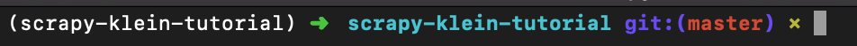

# Desenvolvendo um Crawler API com Scrapy e Klein

## Escopo

Hoje vamos desenvolver uma API para buscar livros por gênero no site http://books.toscrape.com/ . Nossa API deve receber um gênero como parametro, fazer o scraping da página e nos retornar um `json` contendo uma lista com os títulos pertencentes aquele gênero.

### Exemplo

```


```

## Pré-Requisitos

- Python 3
- Pipenv

## Desenvolvendo o Crawler

Para desenv olver o nosso crawler nós vamos utilizar o Scrapy e o site fictício http://books.toscrape.com/ pertencente ao [Web Scraping Sandbox](http://toscrape.com/) do Scrapinghub.

### O que é um Crawler?

### O que é o Scrapy?

### Mãos a obra

#### Configurando o projeto

1. Clone o repositório

`$ git clone https://github.com/betinacosta/scrapy-klein-tutorial.git`

2. Dento da pasta rode o seguinte comando:

`make setup`

Isso irá criar, ativar e instalar tanto o Scrapy quanto o Klein em um virtualenv para podermos utilziar. Caso tudo corra bem, você deve ver algo parecido com isso no seu terminal:



Para testar que o Scrapy foi instalado corretamente, rode o comando abaixo para exibir a versão do framework:

`$ scrapy version`

#### Criando um projeto

1. 


