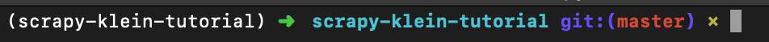
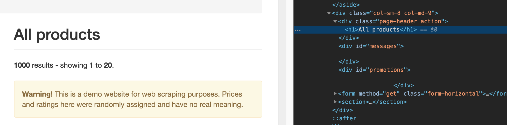
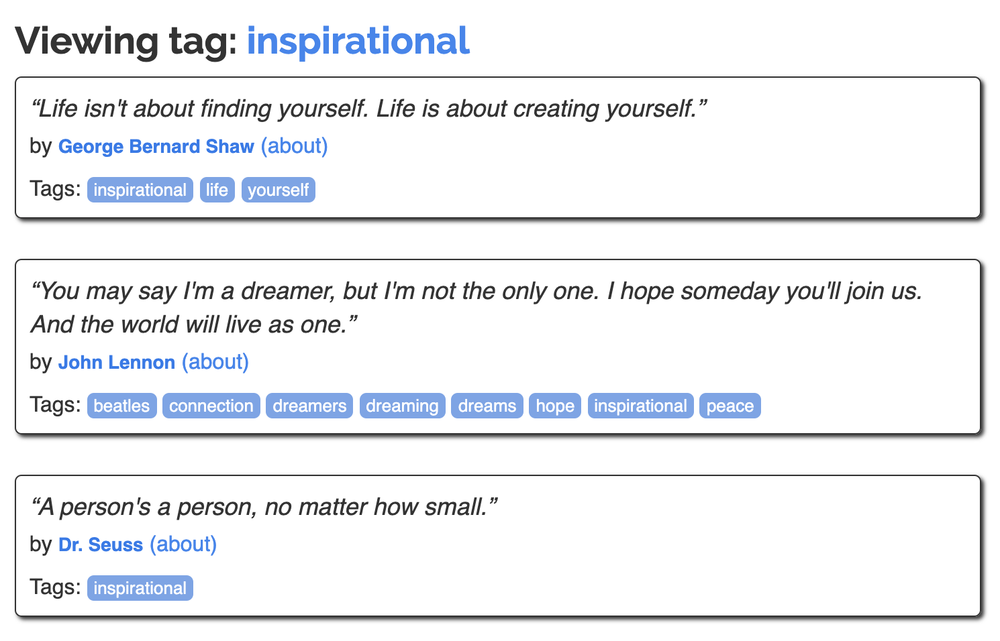
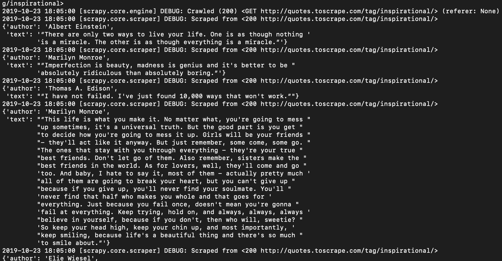

# Developing a Crawler API with Scrapy and Klein

## Scope

Today we will develop an API to search phrases by tags on the site http://quotes.toscrape.com/ . Our API should receive a tag as parameter, scrap the page and return a `json` containing a list with the phrases and authors that belong to that tag.

### Example

```sh
curl -X POST \
  http://localhost:8080/search \
  -d '{"tag": "inspirational"}'
```

```sh
>> [{"text": "\u201cThere are only two ways to live your life. One is as though nothing is a miracle. The other is as though everything is a miracle.\u201d", "author": "Albert Einstein"}]
```

## Requirements

- Python 3
- Pipenv

## Developing the Crawler

We are going to use Scrapy and the "fake" website http://quotes.toscrape.com/ from [Web Scraping Sandbox](http://toscrape.com/) by Scrapinghub to create our crawler.

### What is Scrapy

Scrapy (in case you are wondering, it's pronounced _scray-pee_) is a free and open-source web-crawling framework written in Python. It is currently maintained by Scrapinghub a web-scraping development and services company.

### Why Scrapy?

- It's open source and free to use;
- It's easy to build and scale;
- It has a tool called Selector for data extraction
- Handles calls asynchronously and quickly.

This last one will matter a lot for us in the near future.

### Hand on!

#### Setting up the project

1. Clone the repository

`$ git clone https://github.com/betinacosta/scrapy-klein-tutorial.git`

2. Inside the project folder, run the following command:

`make setup`

This will create, install and activate a virtual environment with Scrapy and Klein.

If all goes well, you should see something like this on your terminal:



To test if Scrapy was install correctly, run the following command to show it's version:

`$ scrapy version`

_*PS.: If you are using windows, the make command may not work. If it's the case run the following commands instead:_

```sh
$ pipenv install
$ pipenv shell
```

#### Creating a Project

1. The scrapy has a command to start a project with everything we need, to do this just run:

`$ scrapy startproject tutorial`

This command created a folder called `tutorial` with the following files:

- **scrapy.cfg**: deploy settings file
- **items.py**: project "itens" definition file
- **middlewares.py** : project middlewares file
- **pipelines.py**: project pipelines file
- **settings.py**: project settings file
- **spiders/**: the folder were our spiders will be located

We will go deeper into explanations for these files as the need arises during the tutorial.

#### Creating our first Spider

Spiders are classes that we define and that Scrapy uses to crawl information on websites.

Let's create a file called `quotes_spider.py` inside the folder `tutorial/tutorial/spiders/` with the following content:

```python
import scrapy


class QuotesSpider(scrapy.Spider):
    name = "quotes"

    def start_requests(self):
        urls = [
            'http://quotes.toscrape.com/',
        ]
        for url in urls:
            yield scrapy.Request(url=url, callback=self.parse)

    def parse(self, response):
        self.log(">>>>>>>>>>>> " + response.url + " <<<<<<<<<<<<<<")
```

Okay, what's going on in that file? The method `start_requests` defines (as the name implies) where our spider will start its activities on the website or websites defined in the variable `urls` and what functions to apply on those websites, defined in the `callback`.

What we are doing in the `parse` method at the moment is simply logging the website url visited by our spider, but in the future we will collect information from the page.

To run our spider, we will go to project folder and execute our spider:

`$ cd tutorial`

`$ scrapy crawl quotes`

Our very creative message, along with the website's url, should have been logged at the `DEBUG` level.

#### Understanding the Page

Before we start collecting information with our spider, we need to better understand the structure of the page from which we want to collect information, and for this we will need understand a little about two of the four horsemen: HTML and CSS. 

We will collect the information we need from the website through selectors. Let's take a look at the website and see where everything is located.

Let's start by the text `Quotes to Scrape`. When you inspect the page you will see that it's inside the `a` tag, inside the `h1` tag, which is found within a `div` with the class `col-md-8`. You can see better in the image bellow:



To test if we can select this text by its class and tags, we will use a very useful scrapy tool: the scrapy shell:

`$ scrapy shell http://quotes.toscrape.com/`

This command will download the page and provide us a `response` object that will allow us to do some operations. To check if we can select the text we want, let's run:

`$ response.css("div.col-md-8>h1>a::text").extract_first()`

It worked! \o/


Ok, but what the hell is that?

`response.css()` is what we use to select page elements based on a css selector. It must receive the path to the desired element.

`div.page-header>h1>a::text` says that we want the `a` tag text that is inside the` h1` tag that is inside the `div` that has the class `col-md-8`.

`extract_first()` response.css will return a `selector` and to extract the information we need from this selector we use the` extract` method. However, it will return a list to us. In this specific case, as we only have one item as content, we can use a variation of this method, the `extract_first` to get the information we want.

#### Getting the quotes by tag

Nice! Now that we have a sense of how to select elements of the page, let's try to select the quotes by a given tag.

Looking at the website and the tag pages, we see that the construction of the page url remains constant, so we will use this to our advantage.

`http://quotes.toscrape.com/tag/tag_name`

__Note__: There are some problems with this approach, such as being based on the fact that urls will always follow this pattern, but that isn't the purpose of the tutorial.

For now, we will consider a fixed tag. Later, we will receive the tag as a parameter in our API.

```python
import scrapy


class QuotesSpider(scrapy.Spider):
    name = "quotes"

    def __init__(self):
        self.tag = "inspirational"

    def start_requests(self):
        base_url = "http://quotes.toscrape.com/tag/"
        urls = [
            base_url + self.tag,
        ]
        for url in urls:
            yield scrapy.Request(url=url, callback=self.parse)

    def parse(self, response):
        self.log(">>>>>>>>>>>> " + response.url + " <<<<<<<<<<<<<<")

```

What we did was add a fixed tag at `__init__` and we used it to build the url in` start_requests`.

Now, let's analyze the page and see how we can get the quote and its author.



We can do this by selecting the `div` containing the quotes and iterating over their selectors:

```python
import scrapy


class QuotesSpider(scrapy.Spider):
    name = "quotes"

    def __init__(self):
        self.tag = "inspirational"

    def start_requests(self):
        base_url = "http://quotes.toscrape.com/tag/"
        urls = [
            base_url + self.tag,
        ]
        for url in urls:
            yield scrapy.Request(url=url, callback=self.parse)

    def parse(self, response):
        quotes_selectors = response.css("div.quote")

        for selector in quotes_selectors:

            quote = selector.css("span.text::text").extract_first()
            author = ?
```

A break to find out how to obtain the author's information. Feel free to use the scrapy shell and ask me for help if you need :)

Okay, if everything goes well (and it will, faith in our goddess Beyoncé), we already have all the information we need. Now let's return this information. For that, we will open the file `tutorial/tutorial/items.py` and create an Item.

To define a formatted output, Scrapy offers the Item class. Item-type objects are simple containers for collecting data. They offer an API similar to a Python dictionary with a convenient language for declaring their available fields.

```python
import scrapy


class Quote(scrapy.Item):
    text = scrapy.Field()
    author = scrapy.Field()
```

And now we will import it into `quotes_spider.py` and use it instead of variables.

```python
import scrapy

from tutorial.items import Quote

class QuotesSpider(scrapy.Spider):
    name = "quotes"

    def __init__(self):
        self.tag = "inspirational"

    def start_requests(self):
        base_url = "http://quotes.toscrape.com/tag/"
        urls = [
            base_url + self.tag,
        ]
        for url in urls:
            yield scrapy.Request(url=url, callback=self.parse)

    def parse(self, response):
        quotes_selectors = response.css("div.quote")

        for selector in quotes_selectors:
            quote = Quote()

            quote["text"] = selector.css("span.text::text").extract_first()
            quote["author"] = your_beautiful_code
```

Cool, and how do we return it? The Scrapy spider usually generates dictionaries containing the data extracted from the page. To do this we use Python's `yield` in the callback.

```python
import scrapy

from tutorial.items import Quote

class QuotesSpider(scrapy.Spider):
    name = "quotes"

    def __init__(self):
        self.tag = "inspirational"

    def start_requests(self):
        base_url = "http://quotes.toscrape.com/tag/"
        urls = [
            base_url + self.tag,
        ]
        for url in urls:
            yield scrapy.Request(url=url, callback=self.parse)

    def parse(self, response):
        quotes_selectors = response.css("div.quote")

        for selector in quotes_selectors:
            quote = Quote()

            quote["text"] = selector.css("span.text::text").extract_first()
            quote["author"] = seu_codigo_bonitao

            yield quote
```

Done! Now if we run our spider with `scrapy crawl quotes` we will see that the information has been successfully collected.



To finish our spider with style, we have another important detail to check: pagination. It is necessary to "repeat" this process for the next pages if they exist. For this, we will add a pagination logic after our `for` and add the variable` start_urls` in our `__init__`. This variable is necessary for the `response.urljoin` method used in pagination, can find itself.

```python
import scrapy

from tutorial.items import Quote

class QuotesSpider(scrapy.Spider):
    name = "quotes"

    def __init__(self):
        self.tag = "inspirational"
        self.start_urls = ["http://quotes.toscrape.com/"]

    def start_requests(self):
        base_url = "http://quotes.toscrape.com/tag/"
        urls = [
            base_url + self.tag,
        ]
        for url in urls:
            yield scrapy.Request(url=url, callback=self.parse)

    def parse(self, response):
        quotes_selectors = response.css("div.quote")

        for selector in quotes_selectors:
            quote = Quote()

            quote["text"] = selector.css("span.text::text").extract_first()
            quote["author"] = your_beautiful_code

            yield quote

        next_page_url = response.css("li.next>a::attr(href)").extract_first()

        if next_page_url:
            next_page_url = response.urljoin(next_page_url)
            yield scrapy.Request(url=next_page_url, callback=self.parse)
```

Done! With that we finish our spider and we can go to the API!

## Developing the API

Now that we have our spider ready! We can proceed to developing the API with Klein!

### Why Klein?

But Betina, with so many more well-known and established frameworks, why the heck use Klein and not Flask, Bottle or even Django (do you want overkill, @?)?

Well, remember I said that the fact that scrapy handles requests asynchronously would be important for this tutorial? So, for that reason it doesn't usually talk very well with those frameworks that are used to making requests synchronously.

Klein is a micro-framework for developing Python services production ready. Twisted is an event-based framework that helps to deal with asynchrony.

### Building app.py

Klein's syntax is very similar to Flask's. to build the basic skeleton of our API just create an `app.py` file at the root of the project. (outside the scrapy scope)

```python
from klein import Klein
app = Klein()

@app.route("/")
def index(request):
    return "Good morning sunshine, soon there will be lunch!"

app.run("localhost", 8080)
```

Let's run this piece to see if it works before moving on:

`$ python app.py`

And in another tab of the terminal:

```sh
curl -X GET \
  http://localhost:8080/
```

Now let's create the endpoint to send a tag to be searched:

```py
from klein import Klein
app = Klein()

@app.route("/")
def index(request):
    return "Good morning sunshine, soon there will be lunch!"

@app.route('/search')
def get_quotes(request):
    content = json.loads(request.content.read())
    tag = content.get("tag")

app.run("localhost", 8080)
```

## Putting it all together

### Spider Runner

Now let's create a runner for our spider. This will enable the programmatic execution of our spider. For this we will create the file `spider_runner.py` at the same level as the app.py

```python

from scrapy import signals
from scrapy.crawler import CrawlerRunner
from scrapy.utils.serialize import ScrapyJSONEncoder

class SpiderRunner(CrawlerRunner):
    def crawl(self, spider, *args, **kwargs):
        self.items = []

        crawler = self.create_crawler(spider)
        crawler.signals.connect(self._collect_item, signals.item_scraped)

        deferred = self._crawl(crawler, *args, **kwargs)
        deferred.addCallback(self._return_items)

        return deferred

    def _collect_item(self, item, response, spider):
        self.items.append(item)

    def _return_items(self, result):
        return self.items
```

The crawl method will be responsible for running our spider.

### Back to the Spider

Before proceeding with the API, we need to prepare our spider to receive a parameter. We will send the tag in the construction of the `QuotesSpider` class.

```py
import scrapy

from tutorial.tutorial.items import Quote

class QuotesSpider(scrapy.Spider):
    name = "quotes"

    def __init__(self, tag):
        self.tag = tag
        self.start_urls = ["http://quotes.toscrape.com/"]
```

### Back to the API

Now let's add a call to the spider_runner in our endpoint and pass the parameter that our Spider expects ...

```py
@app.route('/search')
def get_quotes(request):
    content = json.loads(request.content.read())
    tag = content.get("tag")

    runner = SpiderRunner()

    deferred = runner.crawl(QuotesSpider, tag=tag)
    deferred.addCallback(return_spider_output)

    return deferred
```

... and create the callback we passed to the deferred. This callback is necessary to do the correct json encoding.

```py
def return_spider_output(output):
    _encoder = ScrapyJSONEncoder(ensure_ascii=False)
    return _encoder.encode(output)
```

Don't forget adding the imports!

```py
from scrapy.utils.serialize import ScrapyJSONEncoder
import json

import app
from spider_runner import SpiderRunner
from tutorial.tutorial.spiders.quotes_spider import QuotesSpider
```

Finally, let's execute our project in a tab on the terminal:

`$ python app.py`

And run a curl passing a tag as a parameter!

```sh
curl -X POST \
  http://localhost:8080/search \
  -d '{"tag": "love"}'
```

Done! You have a Spider API running!

## Next Steps

There are several improvements that can be made, I will list some of them as ways to expand the project and continue learning:

- **Tests!** In this tutorial we kind turned the blind eye for the lack of tests. This isn't a good practice. A good way to improve this code is adding tests to it. One way to test our spider unitarily is by using stubs for the pages, this will make development way easier and safe.

- **Error Handling**. Our code is only considering the happy path. It’s good to add error handling when we don’t find a tag for example

- **Search for more than 1 Tag**. We currently support searching for only one tag. How about we look for more tags?

- **Return author's details**. You can try returning more details from the author along with the sentences.

- **Play with `http://books.toscrape.com/`**. This is a very good fictional bookstore for scraping. You can try to search all books of a certain genre this time ...

Did you see anything that can be improved in this tutorial? Don't hesitate to open a PR!

## Contact

- **website**: https://betinacosta.dev/
- **twitter**: https://twitter.com/ngasonicunicorn
- **email**: bmcosta13@gmail.com

## References

- [Scrapy Documentation](https://docs.scrapy.org/en/latest/)
- [Klein Documentation](https://klein.readthedocs.io/en/latest/)
- [Youtube Scrapinghub](https://www.youtube.com/channel/UCYb6YWTBfD0EB53shkN_6vA)
- [Web Scraping Sandbox](http://toscrape.com/)

## Special Thanks

Special thanks to [@lipemorais](https://github.com/lipemorais/) for reviewing the material and giving me emotional support for the second year in a row!